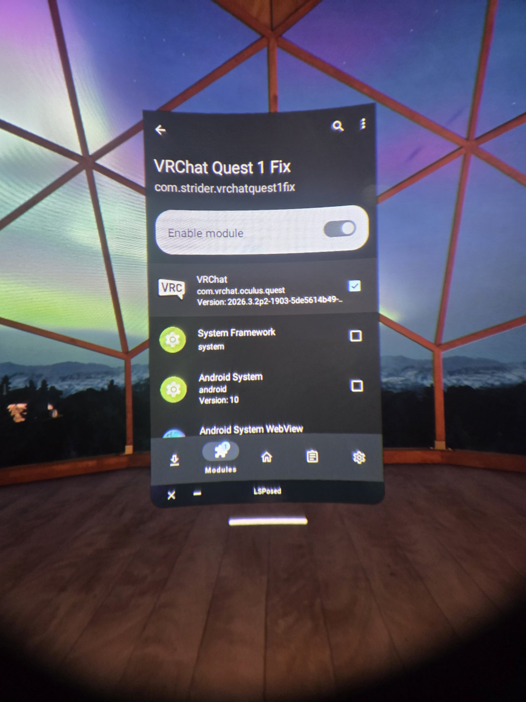

# VRChat on Quest 1 (Rooted)

Run the current VRChat Quest build (**2026.3.2p2**) on a rooted Meta Quest 1.

Tested 2026-09-24: launch, login, and world load all work.

## How it works

The Quest 1 runs Android 10 (API 29) with 64-bit userspace — technically compatible with the current VRChat build. The only hard block is the manifest's `com.oculus.supportedDevices` metadata, which declares `quest2|quest3`. The Quest 1 VR driver aborts init when `quest` isn't in that list.

Patching the manifest is a dead end: VRChat ships with Appdome anti-tamper, and any modified/re-signed APK gets killed ~7 seconds after launch.

Instead, this repo's LSPosed module hooks `ApplicationPackageManager.getApplicationInfo()` **inside the VRChat process only** and rewrites the reported value to `quest2` at runtime. The APK stays byte-for-byte official; the driver sees a supported device and proceeds.

## Prerequisites

- Meta Quest 1, **already rooted** (this guide assumes Magisk via [QuestStack](https://github.com/starseed12345/QuestStack) — rooting itself is out of scope)
- Zygisk enabled in Magisk
- [LSPosed](https://github.com/LSPosed/LSPosed) (Zygisk build) installed and active
- ADB on your PC ([platform-tools](https://developer.android.com/tools/releases/platform-tools))
- Developer Mode enabled on the headset, USB debugging authorized

## Downloads

| File | Source |
|---|---|
| [`VRChatQuest1Fix-lsposed-v2.apk`](./VRChatQuest1Fix-lsposed-v2.apk) | In this repo (13 KB) — click the filename to download |
| Untouched VRChat APK | **Not redistributed.** Download the newest version yourself with Quest App Version Switcher (see below). Tested build: `2026.3.2p2-1903-5de5614b49-Release` (versionCode `1010610`, package `com.vrchat.oculus.quest`) |

> **Critical:** Use the untouched official APK. Do not edit its manifest, patch it, or re-sign it — Appdome will kill it seconds after launch.

### Getting the VRChat APK with QuestAppVersionSwitcher

VRChat isn't on the Quest 1 store, so grab the newest Quest build with QAVS (Quest App Version Switcher):

1. Install [SideQuest](https://sidequestvr.com) and connect your headset
2. Sideload [Quest App Version Switcher (QAVS)](https://sidequestvr.com/app/5333/questappversionswitcher-qavs) by ComputerElite
3. Open QAVS on the headset (check Unknown Sources) and log in with your Meta account
4. Find **VRChat**, download the newest version, and install it directly from QAVS

## Install

> Run each `adb` command one at a time and wait for it to finish. You can also paste a whole block at once — the commands will run in order, one after another.

### 1. Confirm the untouched VRChat build is installed

If you installed VRChat through QAVS above, skip this step — you're already set.

Only needed if VRChat isn't installed yet, or you have an old/modified build: install the untouched APK (replace with your actual filename; uninstall first with `adb uninstall com.vrchat.oculus.quest` if you hit `INSTALL_FAILED_VERSION_DOWNGRADE`):

```bat
adb install -r "name-of-your-vrchat.apk"
```

Do not launch it yet.

### 2. Install and scope the fix module

```bat
adb install -r VRChatQuest1Fix-lsposed-v2.apk
```

If LSPosed Manager isn't visible on the headset after flashing the module and rebooting, install it manually from the module's bundled APK — run these in order:

```bat
adb shell su -c "cp /data/adb/modules/zygisk_lsposed/manager.apk /sdcard/LSPosedManager.apk"
```
```bat
adb pull /sdcard/LSPosedManager.apk
```
```bat
adb install LSPosedManager.apk
```

Then on the headset:
1. Open LSPosed Manager → Modules → enable **VRChat Quest 1 Fix**
2. Open the module's scope and tick **VRChat** (`com.vrchat.oculus.quest`) — nothing else. If VRChat doesn't appear in the list, check the **Hide** tab in Modules — it may be filtering VRChat out. Turn it off.

   It should look like this:

   
3. **Reboot** the headset (required for the scope to take effect)

### 3. Launch

Open VRChat from the library (check Unknown Sources if sideloaded). Sign in, load into a world.

## Verify

```bat
adb shell pm list packages | findstr vrchat
```

should show `package:com.vrchat.oculus.quest`.

Expected result: VRChat opens, logs in, and loads a world with no driver abort.

## Troubleshooting

| Symptom | Fix |
|---|---|
| App closes ~7s after launch | APK was modified/re-signed. Reinstall the untouched official build. |
| Fix seems inactive | Re-check LSPosed: module enabled, VRChat ticked in scope, then reboot. |
| `INSTALL_FAILED_VERSION_DOWNGRADE` | `adb uninstall com.vrchat.oculus.quest`, then install again. |
| `unauthorized` in adb | Accept the USB debugging prompt on the headset. |
| Poor performance in worlds | Expected on Quest 1 hardware — use avatar hiding, smaller instances, simpler worlds. The fix restores compatibility, not Quest 2/3 performance. |

## Notes

- Verified for build `2026.3.2p2` only. Future VRChat updates need re-testing against the same scope.
- This does not modify VRChat's code, assets, or network traffic — it only changes what the OS reports about supported devices, inside the VRChat process.
- Avatar and world thumbnails may not load at all

## License

The LSPosed module in this repo is provided as-is for interoperability. VRChat is a trademark of VRChat Inc.; the VRChat APK is not included here.

## Credits

All code in this repository (the LSPosed fix module) was AI-generated by Muse.

